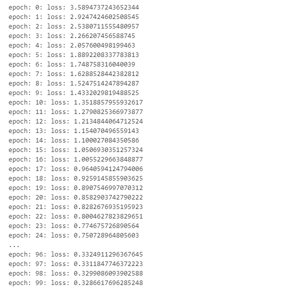
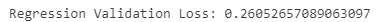
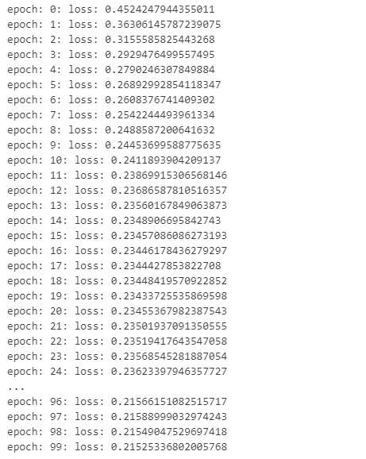
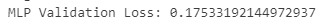

<h1>Regression Solution and Multi-layers Proceptron Solution</h1>

To run this jupyter notebook, python>=3.9, torch, torchvision, pandas are needed.

<h2>Regression</h2>

This is the regression model structure:

<code>regression = nn.Sequential(nn.Linear(features, 1))</code>

Loss after 100 training eopchs of regression model:

Validation Loss:

<h2>Multi-layers Preceptron</h2>

This is the Mutli-layers Preceptron structure:

<code> MLP = nn.Sequential(nn.Flatten(),nn.Linear(features, 256), nn.ReLU(),nn.Linear(256, 1))</code>

Loss after 100 training epochs of MLP models:

Validation Loss:

